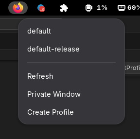

# gnome-ext-firefox-profile-starter

This is Gnome extension that does the following:

1. List available Firefox profiles
2. Launch Firefox specified profile
3. Create a new Firefox profile
4. Launch Firefox in private mode

# Setup

In the top level directory run command `npm install`.

# Deploying 

1. Run command `npm run deploy`
2. Restart Gnome by type `alt + F2` and then pressing `r + <enter>`

